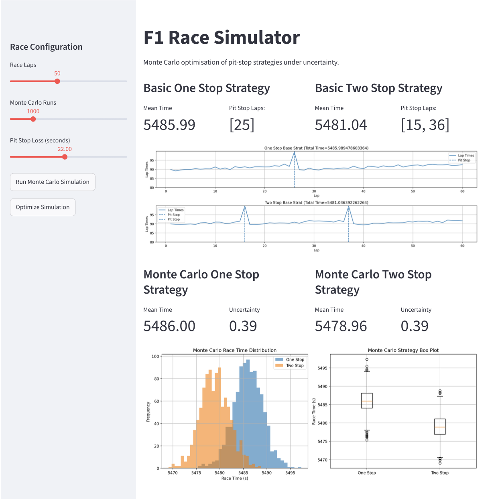
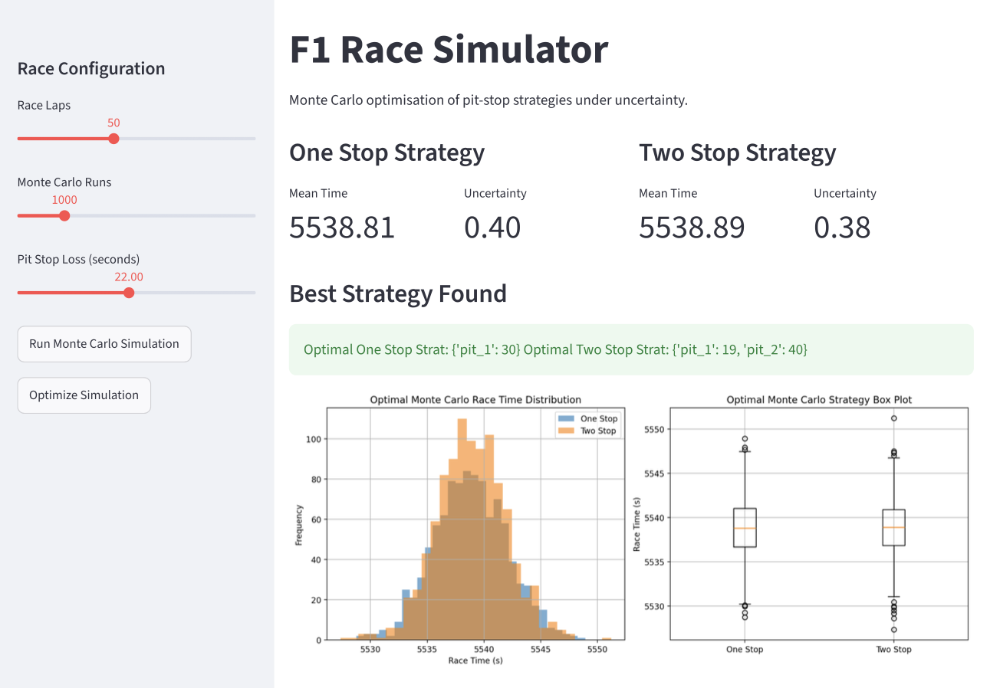

# F1 Race Strategy AI Simulator
## Live Demo
👉 https://f1racesim.streamlit.app/


---

## Overview

A **Monte Carlo + optimisation framework** for evaluating Formula 1 pit-stop strategies under uncertainty.

This project models race performance as a **stochastic system** and uses simulation-based inference to determine optimal strategy decisions.

It combines:
- Probabilistic race simulation
- Monte Carlo estimation
- Bayesian optimisation (Optuna)
- Statistical confidence intervals
- Interactive Streamlit dashboard

---

## Objective

> Determine the optimal pit-stop strategy that minimises expected race time under uncertainty.

Instead of deterministic simulation, this project evaluates **distributional outcomes**.

---

## System Architecture

```
+------------------------------+
| Parameter Configuration      |
| laps, pit loss, strategy     |
+--------------+---------------+
               |
               v
+------------------------------+
| Stochastic Race Simulator    |
| - Lap time model             |
| - Tire degradation           |
| - Pit stop dynamics          |
+--------------+---------------+
               |
               v
+------------------------------+
| Monte Carlo Engine           |
| 100–10,000 rollouts         |
| uncertainty modelling        |
+--------------+---------------+
               |
               v
+------------------------------+
| Statistical Inference       |
| mean / variance / CI        |
+--------------+---------------+
               |
               v
+------------------------------+
| Bayesian Optimisation       |
| Optuna strategy search      |
+--------------+---------------+
               |
               v
+------------------------------+
| Analytics Dashboard         |
| insights + visualisation    |
+------------------------------+
```

---

## Key Features

- Physics-inspired race simulation (lap time + tire degradation + pit stops)
- Monte Carlo simulation (100 - 5000 runs per strategy)
- 95% confidence intervals for robust comparison
- Optuna-based strategy optimisation
- Strategy benchmarking under uncertainty
- Interactive Streamlit dashboard

---

## Dashboard Preview

### Main Dashboard



---

### Optimized Strategy Plots



---

## Example Output

| Strategy | Mean Time | Uncertainty |
|----------|----------|--------------|
| 1-stop   | 5538.83s |    0.5528    |
| 2-stop   | 5538.71s |    0.5446    |

Demonstrates statistically close performance under uncertainty.

---

## Technologies Used

* Python 3.10+
* NumPy
* Matplotlib
* Optuna (Bayesian optimisation)
* Streamlit

---

## Project Structure

```
f1_race_sim/
│
├── main.py                  # Local Testing
├── app.py                  # Streamlit Dashboard
├── simulator/              # Core race simulation engine
│   ├── race.py
│   ├── monte_carlo.py
│   ├── strategy.py
|   ├── state.py
│   └── optuna.py
│
├── assets/
|   ├── f1_base_graphs.png
│   └── f1_optimize_graphs.png
|
│
├── README.md
└── requirements.txt
```

---

## Run Locally

```bash
# Clone repository
git clone https://github.com/Silloh23/f1_race_sim.git
cd f1_race_sim

# Install dependencies
pip install -r requirements.txt

# Run Streamlit dashboard
streamlit run app.py
```
---

## Future Improvements

* Reinforcement learning pit-stop agent
* Weather and safety car modelling
* Multi-car race interactions
* Real F1 telemetry dataset integration

---

## What This Project Demonstrates

* Monte Carlo simulation design
* Stochastic optimisation (Optuna)
* Statistical inference (confidence intervals)
* Modular system architecture
* Experimental ML system design

---

## Author

Built as a simulation + ML systems project exploring:

> decision-making under uncertainty in dynamic racing environments

---

## Live Demo

Try the interactive dashboard here:

👉 https://f1racesim.streamlit.app/